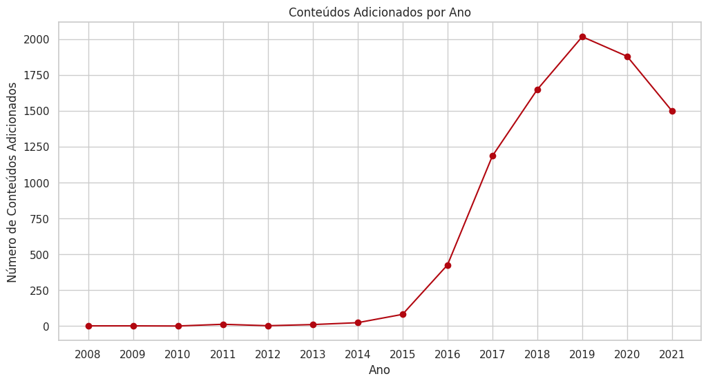

[Leia em português](README.md)

# Netflix: Behind the Scenes of a Successful Catalog (2008-2021)


## ❯ The Mission: Decoding the Netflix Universe

Netflix is more than a streaming service; it's one of the largest digital content libraries in the world, an ever-expanding universe. But behind the familiar interface, what story does the data tell us? What are the strategies, trends, and secrets hidden within thousands of titles?

This project embarks on an **exploratory data analysis journey** to dive deep into the Netflix catalog. Our mission is to act as data detectives, using Python and Looker Studio to uncover the patterns that defined the platform's content between 2008 and 2021.

## 🗺️ The Journey's Map: Data Source

Every great expedition needs a reliable map. Ours is a rich dataset obtained from Kaggle, detailing every movie and series on the platform.

  * **Source:** [Netflix Movies and TV Shows (Kaggle)](https://www.kaggle.com/datasets/shivamb/netflix-shows?resource=download)
  * **Period:** 2008 to 2021

This dataset was our gateway to understanding the catalog's anatomy, with crucial information such as type, country of production, release year, and genre.

## 🛠️ The Explorer's Toolkit: Tools Used

To navigate this sea of data, we were equipped with the best tools from the Data Science ecosystem:

  * **Programming Language:** Python 3
  * **Map and Compass (Data Manipulation):** Pandas library
  * **Magnifying Glasses (Visualization):** Matplotlib & Seaborn libraries
  * **Logbook (Environment):** Jupyter Notebook
  * **Interactive Command Panel:** Looker Studio

## 🧭 The Expedition Log: Exploratory Data Analysis (EDA)

Our journey was documented in the `Netflix.ipynb` notebook and followed a clear script to ensure no detail was lost.

1.  **First Contact:** We loaded the map (`netflix_titles.csv`) and performed an initial inspection to understand the terrain, checking for data integrity and types.
2.  **Clearing the Terrain:** We dealt with the unknown territories of the map, treating missing values for directors, cast, and countries as "Unknown." We removed some dead ends (rows with essential null data) and adjusted our compasses, converting dates into a readable format.
3.  **The Great Discoveries:** With the map cleaned, we began to connect the dots, investigating the proportion of movies and series, identifying the main production centers, and mapping the timeline of the catalog's growth.

## 💡 The Revelations: Key Insights Discovered

After the exploration, three great truths about the Netflix universe came to light.

### Revelation 1: The Reign of Movies

We discovered that the catalog is a realm dominated by movies. Although series generate great discussions, it is the feature films that make up the largest part of the territory.

  * **Movies:** `69.7%` of the catalog
  * **TV Shows:** `30.3%` of the catalog


### Revelation 2: The Titans of Production

The analysis revealed a clear superpower in content production. The United States leads overwhelmingly, but the presence of countries like India and the United Kingdom shows the platform's global investment strategy.


### Revelation 3: The Era of Expansion

The catalog's timeline showed us a story of overwhelming growth. Starting in 2016, Netflix began an era of aggressive expansion, adding content at an unprecedented rate, which peaked in 2019.



## 📊 The Command Panel: Interactive Dashboard

To allow other explorers to navigate these discoveries, all insights were consolidated into an interactive command panel in Looker Studio. Filter, explore, and draw your own conclusions\!

**[\>\> Access the Interactive Dashboard here \<\<](https://lookerstudio.google.com/reporting/4cd71552-dd9b-4872-95e9-da4e3930505f)**

## 🚀 Recreate the Journey: How to Use

Want to follow our steps and conduct your own expedition? It's simple:

1.  **Clone the repository:**

    ```bash
    git clone https://github.com/OYanEnrique/netflix-data-analysis.git
    ```

2.  **Prepare your arsenal (install the dependencies):**

    ```bash
    pip install pandas matplotlib seaborn
    ```

3.  **Open the logbook:**

    ```bash
    jupyter notebook Netflix.ipynb
    ```

-----

## 👨‍💻 The Architect of the Analysis

  * **Yan Enrique**
  * **LinkedIn:** [https://www.linkedin.com/in/yanenrique/](https://www.linkedin.com/in/yanenrique/)
  * **GitHub:** [https://github.com/OYanEnrique](https://github.com/OYanEnrique)
  * **Landing page:** [https://yanenrique.carrd.co](https://yanenrique.carrd.co)

-----
