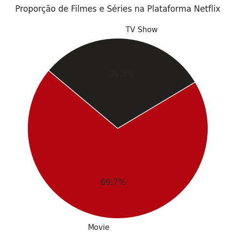
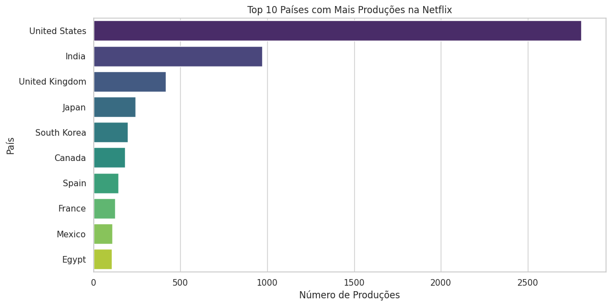
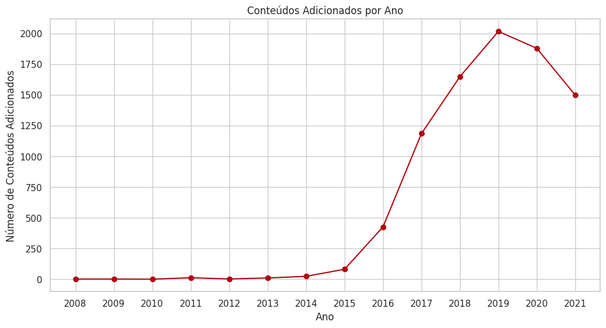
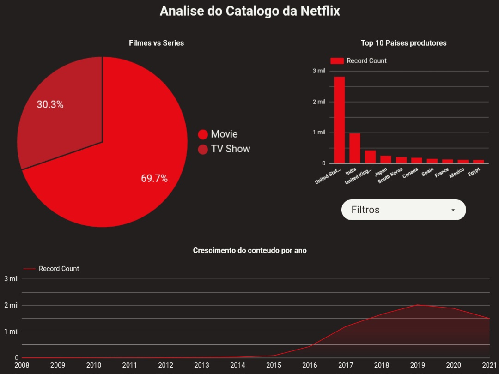

# Análise do Catálogo da Netflix

Este projeto realiza uma análise exploratória dos dados do catálogo da Netflix (2008-2021), utilizando um conjunto de dados disponível no Kaggle. O objetivo é extrair insights sobre a composição do catálogo, as tendências de produção e as preferências de conteúdo. A análise foi desenvolvida em um notebook Jupyter e os resultados foram visualizados em um dashboard interativo no Looker Studio.

## 📄 Índice

* [Sobre o Projeto](#sobre-o-projeto)
* [Fonte dos Dados](#fonte-dos-dados)
* [🛠️ Ferramentas Utilizadas](#ferramentas-utilizadas)
* [🔍 Análise Exploratória de Dados (EDA)](#análise-exploratória-de-dados-eda)
* [💡 Principais Insights](#principais-insights)
* [📊 Dashboard Interativo](#dashboard-interativo)
* [🚀 Como Utilizar](#como-utilizar)

## Sobre o Projeto

Este projeto tem como objetivo principal aprofundar o conhecimento em análise de dados, utilizando Python e suas bibliotecas (Pandas, Matplotlib, Seaborn) para manipulação, análise e visualização de dados. Além disso, busca-se demonstrar a capacidade de comunicar os resultados de forma clara e interativa através de um dashboard no Looker Studio.

## Fonte dos Dados

O conjunto de dados utilizado neste projeto foi obtido do Kaggle: [Netflix Movies and TV Shows](https://www.kaggle.com/datasets/shivamb/netflix-shows?resource=download).

O dataset contém informações sobre filmes e séries de TV disponíveis na Netflix, incluindo:

* `show_id`: ID único para cada título
* `type`: Tipo de conteúdo (Filme ou Série de TV)
* `title`: Título do conteúdo
* `director`: Diretor do conteúdo
* `cast`: Elenco principal
* `country`: País de produção
* `date_added`: Data de adição à Netflix
* `release_year`: Ano de lançamento
* `rating`: Classificação etária
* `duration`: Duração (em minutos para filmes, em temporadas para séries)
* `listed_in`: Gêneros
* `description`: Sinopse

## 🛠️ Ferramentas Utilizadas

* **Linguagem de Programação:** Python 3
* **Bibliotecas Python:**
    * Pandas: Para manipulação e análise de dados.
    * Matplotlib e Seaborn: Para visualização de dados.
* **Ambiente de Desenvolvimento:** Jupyter Notebook
* **Visualização de Dados Interativa:** Looker Studio

## 🔍 Análise Exploratória de Dados (EDA)

A análise exploratória foi realizada no notebook `Netflix.ipynb` e seguiu as seguintes etapas:

1.  **Carregamento e Inspeção Inicial dos Dados:** Leitura do arquivo `netflix_titles.csv` e verificação das primeiras linhas, tipos de dados e informações gerais do dataset.
2.  **Limpeza e Pré-processamento dos Dados:**
    * Tratamento de valores ausentes nas colunas `director`, `cast` e `country`, substituindo-os por "Unknown".
    * Remoção de linhas com valores nulos nas colunas `date_added`, `duration` e `rating`.
    * Conversão da coluna `date_added` para o formato de data e extração do ano e mês de adição.
3.  **Análise e Visualização:**
    * **Proporção de Filmes e Séries:** Análise da distribuição entre filmes e séries de TV no catálogo.
    * **Top 10 Países Produtores:** Identificação dos países com maior número de produções na plataforma.
    * **Evolução da Adição de Conteúdo ao Longo dos Anos:** Análise da tendência de adição de novos títulos anualmente.

## 💡 Principais Insights

* **Predominância de Filmes:** O catálogo da Netflix é composto majoritariamente por filmes, representando aproximadamente **69.7%** do total, enquanto as séries de TV correspondem a **30.3%**.
    
    
    
* **Liderança dos Estados Unidos:** Os Estados Unidos são o maior produtor de conteúdo para a Netflix, seguidos por Índia e Reino Unido.
    
    
    
* **Crescimento Exponencial:** A adição de novos conteúdos na plataforma teve um crescimento expressivo a partir de 2016, atingindo seu pico em 2019.
    
    
    

## 📊 Dashboard Interativo

Para uma exploração mais dinâmica e interativa dos dados, foi criado um dashboard no Looker Studio.

**[Acesse o Dashboard Interativo aqui](https://lookerstudio.google.com/reporting/4cd71552-dd9b-4872-95e9-da4e3930505f)**


O dashboard permite a filtragem dos dados e oferece uma visão consolidada dos principais insights da análise.

## 🚀 Como Utilizar

Para reproduzir a análise, siga os passos abaixo:

1.  Clone o repositório:
    ```bash
    git clone [https://github.com/OYanEnrique/netflix-data-analysis.git](https://github.com/OYanEnrique/netflix-data-analysis.git)
    ```
2.  Instale as dependências:
    ```bash
    pip install pandas matplotlib seaborn
    ```
3.  Execute o Jupyter Notebook:
    ```bash
    jupyter notebook Netflix.ipynb
    ```
